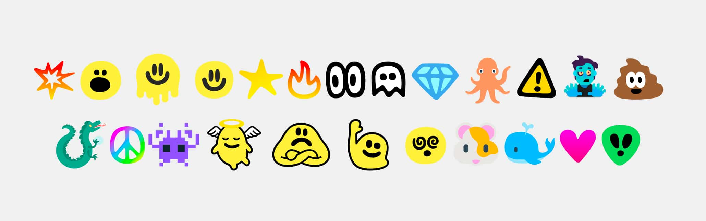

# mishmashmoji
MishMashMoji is a color emoji font available as both OpenType-SVG and COLRv1.



To have the font work in all browsers, read [my blog post](https://fullystacked.net/posts/new-font-face-syntax/#:~:text=Using%20color%20fonts%20with%20tech()).

Some of the glyphs are taken from the open source [Kablammo typeface](https://fonts.withgoogle.com/kablammo), designed by Travis Kochel, with creative direction by Travis Kochel and Lizy Gershenzon, at Vectro Type. I colored them in.

The blob glyphs are customised and colored versions of the black and white [Noto Emoji](https://fonts.google.com/noto/specimen/Noto+Emoji) font from Google, with some outlines from Kablammo. 

I also included some unedited versions of emoji I like from the [FxEmoji](https://github.com/mozilla/fxemoji) font from Mozilla, the Twitter emoji font, and the Microsoft emoji. 

Thank you to all the original creators. 

This font only covers a very limited set of emoji.

In Chrome and Firefox you can customize the colors of the font.


 See my [article](https://css-tricks.com/colrv1-and-css-font-palette-web-typography/) on CSS Tricks for more information. 

e.g.

```css
@font-palette-values --Slime {
            font-family: kablammocolor;
            base-palette: 0;
            override-colors:
            6 #30FA0A;
        }

      h1 {
            font-family: mishmashmoji, emoji;
            font-palette: --Slime;
        }
```